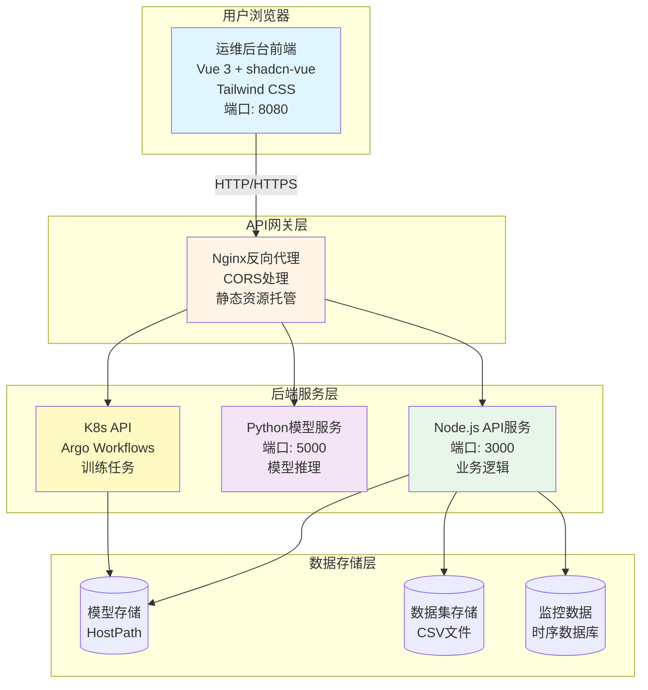
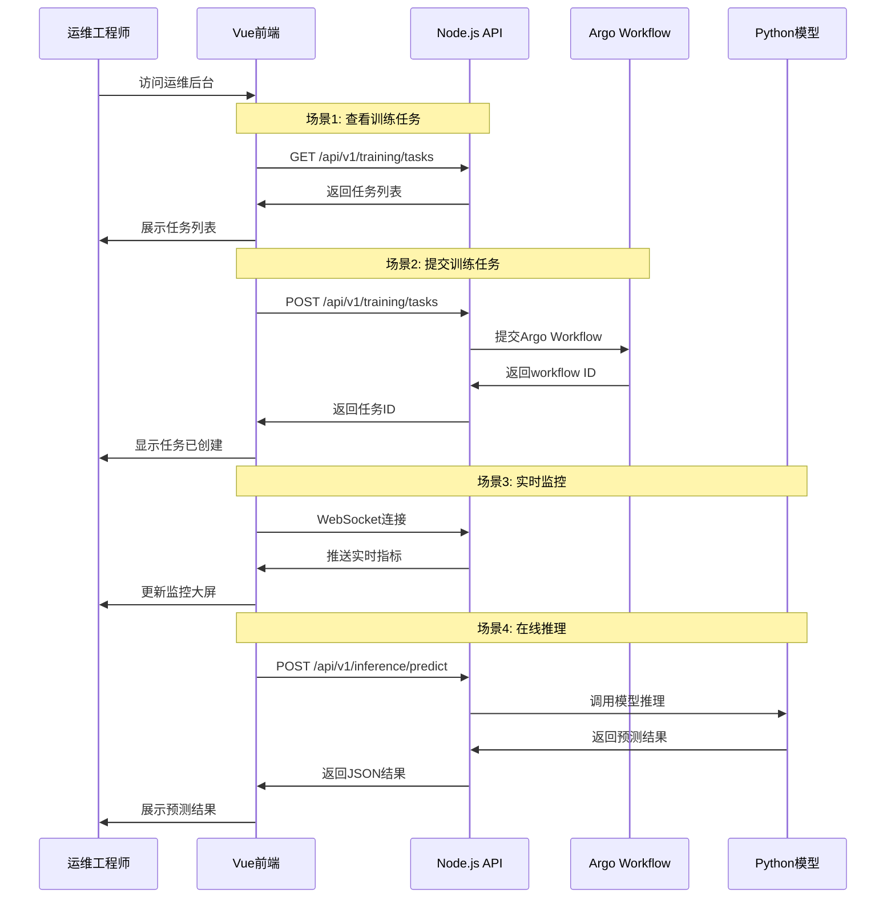

# BERT运维后台管理前端 - 设计文档

> **版本**: v1.0
> **创建日期**: 2025-01-22
> **目标用户**: 运维工程师
> **技术栈**: Vue 3 + shadcn-vue + Tailwind CSS

---

## 📋 目录

- [1. 项目概述](#1-项目概述)
- [2. 整体架构设计](#2-整体架构设计)
- [3. 页面布局与导航](#3-页面布局与导航)
- [4. 核心功能模块](#4-核心功能模块)
- [5. 数据流与API设计](#5-数据流与api设计)
- [6. 前端项目结构](#6-前端项目结构)
- [7. 技术实现要点](#7-技术实现要点)
- [8. 部署方案](#8-部署方案)
- [9. 开发计划](#9-开发计划)

---

## 1. 项目概述

### 1.1 项目目标

为BERT模型训练和推理服务提供一个**可视化的运维管理后台**,让运维工程师能够:

- ✅ 管理模型训练任务(提交、监控、取消)
- ✅ 管理训练数据集(上传、验证、预览)
- ✅ 实时监控服务状态(性能指标、资源使用)
- ✅ 在线测试模型推理(单条、批量、对比)

### 1.2 核心功能

| 功能模块 | 优先级 | 说明 |
|---------|-------|------|
| 模型训练管理 | P0 | 提交训练任务、查看进度、管理模型版本 |
| 数据集管理 | P0 | 上传数据、验证质量、预览数据 |
| 服务监控与统计 | P0 | 实时监控、性能分析、日志查询 |
| 在线推理测试 | P1 | 单条测试、批量预测、模型对比 |

### 1.3 用户角色

**主要用户**: 运维工程师

**特点**:
- 关注系统监控、服务稳定性
- 不需要深入调参
- 需要清晰的监控指标和日志
- 需要便捷的操作界面

---

## 2. 整体架构设计

### 2.1 系统架构图



### 2.2 技术栈选型

#### 前端技术栈

| 技术 | 版本 | 用途 |
|------|------|------|
| **Vue** | 3.4+ | 渐进式前端框架 |
| **TypeScript** | 5.0+ | 类型安全 |
| **Vite** | 5.0+ | 构建工具,快速热更新 |
| **shadcn-vue** | latest | UI组件库(基于Radix UI) |
| **Tailwind CSS** | 3.4+ | 原子化CSS框架 |
| **Pinia** | 2.0+ | 状态管理 |
| **Vue Router** | 4.0+ | 路由管理 |
| **ECharts** | 5.0+ | 数据可视化 |
| **Axios** | 1.6+ | HTTP客户端 |

#### 为什么选择 shadcn-vue?

✅ **现代设计**: 基于 Radix UI 无障碍组件
✅ **完全可定制**: 复制代码到项目,完全掌控
✅ **TypeScript 友好**: 类型完善
✅ **轻量级**: 只复制需要的组件
✅ **Tailwind 集成**: 样式完全自定义
✅ **暗色模式**: 内置主题切换

### 2.3 系统交互流程



---

## 3. 页面布局与导航

### 3.1 整体布局结构

采用经典的**后台管理布局**:

```
┌─────────────────────────────────────────────────────────┐
│  🤖 BERT运维平台    面包屑导航      用户菜单  主题切换  │  ← 顶部导航栏
├──────────┬──────────────────────────────────────────────┤
│          │                                              │
│  📊      │         ┌─────────────────────────────┐     │
│  概览    │         │                              │     │
│          │         │     动态内容区域             │     │
│  🚀      │         │     (路由页面)               │     │
│  训练    │         │                              │     │
│  ├ 任务管理│         │                              │     │
│  ├ 模型版本│         │                              │     │
│  └ 训练配置│         │                              │     │
│          │         │                              │     │
│  📦      │         │                              │     │
│  数据集  │         │                              │     │
│  ├ 数据管理│         │                              │     │
│  └ 数据预览│         │                              │     │
│          │         │                              │     │
│  🧪      │         │                              │     │
│  推理    │         │                              │     │
│  ├ 在线测试│         │                              │     │
│  └ 批量预测│         │                              │     │
│          │         │                              │     │
│  ⚙️      │         │                              │     │
│  系统设置│         │                              │     │
└──────────┴──────────────────────────────────────────────┘
   侧边栏                    主内容区
```

### 3.2 导航菜单结构

```typescript
interface MenuItem {
  icon: string
  label: string
  path?: string
  badge?: number
  children?: MenuItem[]
}

const menuItems: MenuItem[] = [
  {
    icon: 'layout-dashboard',
    label: '概览',
    path: '/dashboard'
  },
  {
    icon: 'rocket',
    label: '模型训练',
    children: [
      { icon: 'list', label: '训练任务', path: '/training/tasks' },
      { icon: 'layers', label: '模型版本', path: '/training/models' },
      { icon: 'settings', label: '训练配置', path: '/training/config' }
    ]
  },
  {
    icon: 'database',
    label: '数据集管理',
    children: [
      { icon: 'upload', label: '数据上传', path: '/datasets/upload' },
      { icon: 'table', label: '数据管理', path: '/datasets/list' },
      { icon: 'eye', label: '数据预览', path: '/datasets/preview' }
    ]
  },
  {
    icon: 'flask-conical',
    label: '在线推理',
    children: [
      { icon: 'play', label: '单条测试', path: '/inference/single' },
      { icon: 'list-tree', label: '批量预测', path: '/inference/batch' },
      { icon: 'git-compare', label: '模型对比', path: '/inference/compare' }
    ]
  },
  {
    icon: 'activity',
    label: '服务监控',
    children: [
      { icon: 'gauge', label: '实时监控', path: '/monitoring/realtime' },
      { icon: 'bar-chart', label: '统计分析', path: '/monitoring/stats' },
      { icon: 'file-text', label: '访问日志', path: '/monitoring/logs' }
    ]
  },
  {
    icon: 'settings',
    label: '系统设置',
    path: '/settings'
  }
]
```

### 3.3 路由配置

```typescript
// router/index.ts
const routes = [
  {
    path: '/',
    component: () => import('@/layouts/DefaultLayout.vue'),
    children: [
      { path: '', component: () => import('@/pages/index.vue') },

      // 训练相关
      {
        path: 'training',
        children: [
          { path: 'tasks', component: () => import('@/pages/training/tasks.vue') },
          { path: 'tasks/new', component: () => import('@/pages/training/tasks-new.vue') },
          { path: 'tasks/:id', component: () => import('@/pages/training/tasks-[id].vue') },
          { path: 'models', component: () => import('@/pages/training/models.vue') },
          { path: 'config', component: () => import('@/pages/training/config.vue') }
        ]
      },

      // 数据集相关
      {
        path: 'datasets',
        children: [
          { path: '', component: () => import('@/pages/datasets/index.vue') },
          { path: 'upload', component: () => import('@/pages/datasets/upload.vue') },
          { path: ':id', component: () => import('@/pages/datasets/[id].vue') },
          { path: ':id/preview', component: () => import('@/pages/datasets/[id]-preview.vue') }
        ]
      },

      // 推理相关
      {
        path: 'inference',
        children: [
          { path: 'single', component: () => import('@/pages/inference/single.vue') },
          { path: 'batch', component: () => import('@/pages/inference/batch.vue') },
          { path: 'compare', component: () => import('@/pages/inference/compare.vue') }
        ]
      },

      // 监控相关
      {
        path: 'monitoring',
        children: [
          { path: 'realtime', component: () => import('@/pages/monitoring/realtime.vue') },
          { path: 'stats', component: () => import('@/pages/monitoring/stats.vue') },
          { path: 'logs', component: () => import('@/pages/monitoring/logs.vue') }
        ]
      },

      { path: 'settings', component: () => import('@/pages/settings.vue') }
    ]
  }
]
```

---

## 4. 核心功能模块

### 4.1 模型训练管理

#### 4.1.1 训练任务列表页

**页面路径**: `/training/tasks`

**功能**:
- 展示所有训练任务
- 筛选(状态/数据集/时间)
- 批量操作
- 查看任务详情

**界面布局**:

```
┌─────────────────────────────────────────────────────────┐
│  🚀 训练任务管理                    [新建训练任务]     │
├─────────────────────────────────────────────────────────┤
│  筛选: [全部状态 ▼] [数据集 ▼] [时间范围] [搜索... ]  │
│                                                         │
│  ┌─────────────────────────────────────────────────┐   │
│  │ 任务列表表格                                    │   │
│  │                                                 │   │
│  │ 列: 任务ID | 名称 | 数据集 | 类型 | 状态 | 进度  │   │
│  │     创建时间 | 耗时 | 操作                      │   │
│  │                                                 │   │
│  │ [分页]                                         │   │
│  └─────────────────────────────────────────────────┘   │
└─────────────────────────────────────────────────────────┘
```

**表格列定义**:

| 列名 | 字段 | 说明 |
|------|------|------|
| 任务ID | `id` | 唯一标识,可点击查看详情 |
| 任务名称 | `name` | 用户自定义名称 |
| 数据集 | `datasetName` | 使用的数据集名称 |
| 任务类型 | `taskType` | 层级分类/情感分析等 |
| 状态 | `status` | ⏳排队/🔄运行中/✅成功/❌失败 |
| 进度 | `progress` | 进度条显示 0-100% |
| 创建时间 | `createdAt` | 格式: YYYY-MM-DD HH:mm:ss |
| 耗时 | `duration` | 显示为 X分X秒 |
| 操作 | - | [详情][日志][取消][删除] |

**状态颜色配置**:

```typescript
const statusConfig = {
  pending: {
    label: '排队',
    color: 'gray',
    icon: 'clock',
    bgColor: 'bg-gray-100',
    textColor: 'text-gray-700'
  },
  running: {
    label: '运行中',
    color: 'blue',
    icon: 'loader-2',
    bgColor: 'bg-blue-100',
    textColor: 'text-blue-700',
    animate: true  // 旋转动画
  },
  succeeded: {
    label: '成功',
    color: 'green',
    icon: 'check-circle',
    bgColor: 'bg-green-100',
    textColor: 'text-green-700'
  },
  failed: {
    label: '失败',
    color: 'red',
    icon: 'x-circle',
    bgColor: 'bg-red-100',
    textColor: 'text-red-700'
  },
  cancelled: {
    label: '已取消',
    color: 'orange',
    icon: 'ban',
    bgColor: 'bg-orange-100',
    textColor: 'text-orange-700'
  }
}
```

#### 4.1.2 新建训练任务

**页面路径**: `/training/tasks/new`

**表单字段**:

```typescript
interface TrainingTaskForm {
  // 基础配置
  taskName: string              // 任务名称 *
  taskType: TaskType            // 任务类型 *
  datasetId: string             // 数据集 *

  // 模型配置
  baseModel: string             // 基础模型
  pretrainedModel?: string      // 已训练模型(微调)

  // 训练参数
  batchSize: number             // 批次大小 (默认: 16)
  learningRate: number          // 学习率 (默认: 2e-5)
  numEpochs: number             // 训练轮数 (默认: 5)
  max_length: number            // 最大序列 (默认: 128)
  warmupSteps: number           // 预热步数 (默认: 500)
  weight_decay: number          // 权重衰减 (默认: 0.01)

  // 高级选项
  useGPU: boolean               // 使用GPU
  saveCheckpoint: boolean       // 保存检查点
  validationSteps: number       // 验证步数

  // 通知设置
  notifyOnComplete: boolean     // 完成通知
  notifyEmail?: string          // 邮箱
}

type TaskType =
  | 'hierarchical-classification'  // 层级分类
  | 'single-label-classification'  // 单标签
  | 'multi-label-classification'   // 多标签
  | 'product-tagging'              // 产品ID打标
  | 'sentiment-analysis'           // 情感分析
  | 'summarization'                // 文本摘要
  | 'keyword-extraction'           // 关键词提取
```

**表单验证规则**:

```typescript
const formRules = {
  taskName: [
    { required: true, message: '请输入任务名称' },
    { min: 2, max: 50, message: '长度在2-50个字符' }
  ],
  taskType: [
    { required: true, message: '请选择任务类型' }
  ],
  datasetId: [
    { required: true, message: '请选择数据集' }
  ],
  learningRate: [
    { type: 'number', min: 1e-7, max: 1e-3, message: '范围: 1e-7 到 1e-3' }
  ],
  batchSize: [
    { type: 'number', min: 1, max: 128, message: '范围: 1-128' }
  ],
  numEpochs: [
    { type: 'number', min: 1, max: 100, message: '范围: 1-100' }
  ]
}
```

#### 4.1.3 训练详情页

**页面路径**: `/training/tasks/:id`

**功能**:
- 实时显示训练进度
- 展示训练曲线(Loss/Accuracy)
- 滚动显示训练日志
- 资源使用情况(GPU/CPU/内存)

**界面布局**:

```
┌─────────────────────────────────────────────────────────┐
│  📊 训练任务详情                              [返回列表] │
├─────────────────────────────────────────────────────────┤
│  状态卡片: 状态 | 耗时 | 准确率 | GPU使用 | Loss值      │
│                                                         │
│  📈 训练曲线 (ECharts)                                  │
│  ┌─────────────────────────────────────────────────┐   │
│  │ Loss曲线     Accuracy曲线                      │   │
│  │ [双Y轴折线图]                                  │   │
│  └─────────────────────────────────────────────────┘   │
│                                                         │
│  📝 训练日志 (实时滚动)                                │
│  ┌─────────────────────────────────────────────────┐   │
│  │ [终端风格日志显示]                             │   │
│  │ 2025-01-22 14:30:00 [INFO] 开始训练任务        │   │
│  │ 2025-01-22 14:31:00 [INFO] Epoch 1/5 - Loss: 0.85│   │
│  │ ...                                            │   │
│  └─────────────────────────────────────────────────┘   │
│                                                         │
│  [取消训练]  [下载日志]  [导出模型]                    │
└─────────────────────────────────────────────────────────┘
```

**WebSocket实时更新**:

```typescript
// composables/useTrainingWebSocket.ts
export function useTrainingWebSocket(taskId: string) {
  const ws = ref<WebSocket | null>(null)
  const status = ref<TaskStatus>('pending')
  const logs = ref<string[]>([])
  const progress = ref(0)
  const metrics = ref<TrainingMetrics | null>(null)

  const connect = () => {
    ws.value = new WebSocket(`ws://localhost:3000/ws?task=${taskId}`)

    ws.value.onmessage = (event) => {
      const message: WSMessage = JSON.parse(event.data)

      switch (message.type) {
        case 'task.status_update':
          status.value = message.payload.status
          break
        case 'task.log_line':
          logs.value.push(message.payload.log)
          break
        case 'task.progress':
          progress.value = message.payload.progress
          metrics.value = message.payload
          break
      }
    }
  }

  return { status, logs, progress, metrics, connect }
}
```

---

### 4.2 数据集管理

#### 4.2.1 数据集列表页

**页面路径**: `/datasets/list`

**功能**:
- 卡片式展示所有数据集
- 快速预览数据集信息
- 搜索和筛选

**界面布局**:

```
┌─────────────────────────────────────────────────────────┐
│  📦 数据集管理                      [上传数据] [批量导入]│
├─────────────────────────────────────────────────────────┤
│  筛选: [全部类型 ▼] [搜索名称或ID              ]       │
│                                                         │
│  ┌─────────────┐  ┌─────────────┐  ┌─────────────┐    │
│  │金融意图分类  │  │情感分析     │  │产品ID打标   │    │
│  │V2          │  │JD评论      │  │             │    │
│  ├───────────┤  ├───────────┤  ├───────────┤    │
│  │📝 1,001条  │  │📝 25,000条 │  │📝 5,000条  │    │
│  │🏷️ 层级分类 │  │🏷️ 二分类  │  │🏷️ 产品打标│    │
│  │📅 2025-01-22│ │📅 2024-12-15│ │📅 2025-01-20│    │
│  │[详情][预览]│  │[详情][预览]│  │[详情][预览]│    │
│  └─────────────┘  └─────────────┘  └─────────────┘    │
│                                                         │
│  [分页]                                                │
└─────────────────────────────────────────────────────────┘
```

#### 4.2.2 数据上传页

**页面路径**: `/datasets/upload`

**步骤流程**:

1. **选择数据类型**
   - 层级分类数据
   - 单标签数据
   - 产品ID打标
   - 情感分析
   - 文本摘要
   - 关键词提取

2. **上传文件**
   - 支持拖拽上传
   - 格式: CSV, TSV, Excel
   - 限制: 100MB

3. **配置元信息**
   - 数据集名称
   - 描述
   - 列映射
   - 数据分割比例

4. **数据验证**
   - 自动识别列
   - 数据质量检查
   - 预览前几行

**文件上传组件**:

```vue
<!-- components/dataset/FileUpload.vue -->
<template>
  <div
    class="border-2 border-dashed rounded-lg p-12 text-center"
    :class="isDragging ? 'border-primary bg-primary/5' : 'border-gray-300'"
    @dragover.prevent="isDragging = true"
    @dragleave.prevent="isDragging = false"
    @drop.prevent="handleDrop"
  >
    <Upload class="w-12 h-12 mx-auto mb-4 text-gray-400" />
    <p class="text-lg font-medium">拖拽CSV文件到这里</p>
    <p class="text-sm text-gray-500 mt-2">
      或 <Button variant="link" @click="selectFile">选择文件</Button>
    </p>
    <p class="text-xs text-gray-400 mt-4">
      支持格式: CSV, TSV, Excel | 文件大小限制: 100MB
    </p>
  </div>
</template>
```

#### 4.2.3 数据预览页

**页面路径**: `/datasets/:id/preview`

**功能**:
- 表格形式展示数据
- 列信息统计
- 数据质量报告
- 导出功能

---

### 4.3 服务监控与统计

#### 4.3.1 实时监控大屏

**页面路径**: `/monitoring/realtime`

**功能**:
- 实时展示核心指标
- 动态图表更新
- 资源使用情况
- 最近告警

**核心指标卡片**:

```
┌────────────┬────────────┬────────────┬────────────┐
│ 🟢 服务健康│ ⚡ QPS    │ 📈 响应时间│ 💾 GPU使用 │
│   99.9%   │  1,250/s  │   85ms    │   78%     │
│  ↑ 0.1%   │  ↑ 12%   │  ↓ 5ms    │  ↗ 稳定   │
└────────────┴────────────┴────────────┴────────────┘
```

**ECharts图表配置**:

```typescript
// 请求量趋势图
const requestVolumeOption = {
  title: { text: '请求量趋势 (近1小时)' },
  tooltip: { trigger: 'axis' },
  xAxis: { type: 'time' },
  yAxis: { type: 'value', name: 'QPS' },
  series: [{
    type: 'line',
    smooth: true,
    areaStyle: { opacity: 0.3 },
    data: []  // 从API获取
  }]
}

// 响应时间分布
const responseTimeOption = {
  title: { text: '响应时间分布' },
  tooltip: { trigger: 'item' },
  series: [{
    type: 'pie',
    radius: ['40%', '70%'],
    data: [
      { value: 60, name: '<50ms' },
      { value: 30, name: '50-100ms' },
      { value: 10, name: '>100ms' }
    ]
  }]
}
```

#### 4.3.2 统计分析页

**页面路径**: `/monitoring/stats`

**功能**:
- 选择时间范围
- 详细统计数据
- Top 10查询
- 模型调用分布

---

### 4.4 在线推理测试

#### 4.4.1 单条测试页

**页面路径**: `/inference/single`

**功能**:
- 选择模型版本
- 输入测试文本
- 显示详细结果
- 保存到测试集

**结果展示**:

```
一级分类
┌─────────────────────────────────────────┐
│ 🏷️ 投资理财                             │
│ 📊 置信度: ████████████ 98.5%           │
└─────────────────────────────────────────┘

二级分类
┌─────────────────────────────────────────┐
│ 🏷️ 基金投资                             │
│ 📊 置信度: ████████░░░ 95.2%           │
└─────────────────────────────────────────┘

三级分类
┌─────────────────────────────────────────┐
│ 🏷️ 开放式基金                           │
│ 📊 置信度: ███████░░░░ 92.1%           │
└─────────────────────────────────────────┘
```

#### 4.4.2 批量预测页

**页面路径**: `/inference/batch`

**功能**:
- 上传CSV文件
- 配置批处理参数
- 实时显示进度
- 下载结果文件

#### 4.4.3 模型对比页

**页面路径**: `/inference/compare`

**功能**:
- 选择两个模型版本
- 运行对比测试
- 展示差异分析
- 生成对比报告

---

## 5. 数据流与API设计

### 5.1 API基础配置

**基础URL**: `http://localhost:3000/api/v1`

**请求格式**:
- Content-Type: `application/json`
- 认证: `Bearer {token}` (如需要)

**响应格式**:
```typescript
interface APIResponse<T> {
  code: number          // 状态码
  message: string       // 消息
  data: T              // 数据
  timestamp: string     // 时间戳
}
```

### 5.2 训练任务API

```typescript
// GET /api/v1/training/tasks
// 获取训练任务列表
interface GetTasksParams {
  page?: number
  pageSize?: number
  status?: TaskStatus
  datasetId?: string
  taskType?: TaskType
}

// POST /api/v1/training/tasks
// 创建训练任务
interface CreateTaskRequest {
  taskName: string
  taskType: TaskType
  datasetId: string
  baseModel?: string
  batchSize: number
  learningRate: number
  numEpochs: number
  useGPU: boolean
}

// GET /api/v1/training/tasks/:id
// 获取任务详情
interface GetTaskResponse {
  task: TrainingTaskDetail
  logs: string[]
  metrics: TrainingMetrics
}

// DELETE /api/v1/training/tasks/:id
// 取消任务
```

### 5.3 数据集API

```typescript
// GET /api/v1/datasets
// 获取数据集列表
interface GetDatasetsResponse {
  datasets: DatasetInfo[]
  total: number
}

// POST /api/v1/datasets/upload
// 上传数据集 (multipart/form-data)
interface UploadDatasetRequest {
  file: File
  datasetName: string
  taskType: TaskType
  columnMapping: ColumnMapping
}

// GET /api/v1/datasets/:id/preview
// 数据预览
interface GetDatasetPreviewResponse {
  data: DataRow[]
  total: number
  columns: string[]
}
```

### 5.4 推理API

```typescript
// POST /api/v1/inference/predict
// 单条推理
interface PredictRequest {
  text: string
  modelId?: string
  returnScores?: boolean
}

interface PredictResponse {
  predictions: {
    level1?: LabelScore
    level2?: LabelScore
    level3?: LabelScore
  }
  inferenceTime: number
}

// POST /api/v1/inference/predict-batch
// 批量推理
interface PredictBatchRequest {
  texts: string[]
  modelId?: string
  batchSize?: number
}

interface PredictBatchResponse {
  jobId: string
  status: 'processing' | 'completed'
}
```

### 5.5 监控API

```typescript
// GET /api/v1/monitoring/metrics
// 获取实时指标
interface GetMetricsResponse {
  system: SystemMetrics
  service: ServiceMetrics
}

// GET /api/v1/monitoring/stats
// 获取统计数据
interface GetStatsParams {
  timeRange: '1h' | '24h' | '7d' | '30d'
}

interface GetStatsResponse {
  requestVolume: TimeSeriesData[]
  responseTime: TimeSeriesData[]
  modelUsage: ModelUsageData[]
}
```

### 5.6 WebSocket实时通信

**连接**: `ws://localhost:3000/ws`

**消息类型**:

```typescript
interface WSMessage {
  type: MessageType
  payload: any
  timestamp: string
}

type MessageType =
  | 'task.status_update'      // 任务状态更新
  | 'task.log_line'           // 日志行
  | 'task.progress'           // 训练进度
  | 'metrics.update'          // 监控指标
  | 'alert.triggered'         // 告警
```

**使用示例**:

```typescript
const ws = new WebSocket('ws://localhost:3000/ws?task=xxx')

ws.onmessage = (event) => {
  const message: WSMessage = JSON.parse(event.data)

  if (message.type === 'task.progress') {
    // 更新进度条
    progress.value = message.payload.progress
  }
}
```

---

## 6. 前端项目结构

```
frontend-admin/
├── public/
│   └── favicon.ico
├── src/
│   ├── assets/
│   │   ├── styles/
│   │   │   ├── tailwind.css
│   │   │   └── globals.css
│   │   └── images/
│   ├── components/
│   │   ├── ui/                    # shadcn-vue组件
│   │   │   ├── button/
│   │   │   ├── card/
│   │   │   ├── table/
│   │   │   ├── form/
│   │   │   └── ...
│   │   ├── layout/
│   │   │   ├── AppHeader.vue
│   │   │   ├── AppSidebar.vue
│   │   │   └── DefaultLayout.vue
│   │   ├── training/
│   │   │   ├── TaskList.vue
│   │   │   ├── TaskForm.vue
│   │   │   ├── TaskCard.vue
│   │   │   └── TrainingChart.vue
│   │   ├── dataset/
│   │   │   ├── DatasetList.vue
│   │   │   ├── DatasetCard.vue
│   │   │   ├── UploadForm.vue
│   │   │   └── DataPreview.vue
│   │   ├── inference/
│   │   │   ├── SingleTest.vue
│   │   │   ├── BatchPredict.vue
│   │   │   └── ModelCompare.vue
│   │   └── monitoring/
│   │       ├── MetricsCard.vue
│   │       ├── RealtimeChart.vue
│   │       └── StatsPanel.vue
│   ├── composables/
│   │   ├── useWebSocket.ts
│   │   ├── useTraining.ts
│   │   ├── useDataset.ts
│   │   └── useMetrics.ts
│   ├── lib/
│   │   ├── api.ts                 # Axios配置
│   │   ├── utils.ts               # 工具函数
│   │   └── constants.ts           # 常量
│   ├── pages/
│   │   ├── index.vue
│   │   ├── training/
│   │   ├── datasets/
│   │   ├── inference/
│   │   └── monitoring/
│   ├── router/
│   │   └── index.ts
│   ├── stores/
│   │   ├── user.ts
│   │   ├── training.ts
│   │   └── monitoring.ts
│   ├── types/
│   │   ├── api.d.ts
│   │   ├── training.d.ts
│   │   └── dataset.d.ts
│   ├── App.vue
│   └── main.ts
├── .env.example
├── components.json                # shadcn-vue配置
├── tailwind.config.js
├── tsconfig.json
├── vite.config.ts
└── package.json
```

---

## 7. 技术实现要点

### 7.1 状态管理 (Pinia)

```typescript
// stores/training.ts
import { defineStore } from 'pinia'
import { ref, computed } from 'vue'

export const useTrainingStore = defineStore('training', () => {
  const tasks = ref<TrainingTask[]>([])
  const currentTask = ref<TrainingTask | null>(null)
  const loading = ref(false)

  const runningTasks = computed(() =>
    tasks.value.filter(t => t.status === 'running')
  )

  async function fetchTasks(params?: GetTasksParams) {
    loading.value = true
    try {
      const response = await api.get('/training/tasks', { params })
      tasks.value = response.tasks
    } finally {
      loading.value = false
    }
  }

  return {
    tasks,
    currentTask,
    loading,
    runningTasks,
    fetchTasks
  }
})
```

### 7.2 API客户端配置

```typescript
// lib/api.ts
import axios from 'axios'
import { toast } from 'vue-sonner'

const apiClient = axios.create({
  baseURL: import.meta.env.VITE_API_URL || '/api/v1',
  timeout: 30000,
})

// 请求拦截器
apiClient.interceptors.request.use((config) => {
  const token = localStorage.getItem('auth_token')
  if (token) {
    config.headers.Authorization = `Bearer ${token}`
  }
  return config
})

// 响应拦截器
apiClient.interceptors.response.use(
  (response) => response.data,
  (error) => {
    const apiError = error.response?.data
    toast.error(apiError?.message || '网络请求失败')
    return Promise.reject(error)
  }
)

export default apiClient
```

### 7.3 主题切换

```vue
<!-- components/layout/ThemeToggle.vue -->
<template>
  <Button variant="ghost" size="icon" @click="toggleTheme">
    <Sun v-if="isDark" class="h-5 w-5" />
    <Moon v-else class="h-5 w-5" />
  </Button>
</template>

<script setup lang="ts">
import { ref, onMounted } from 'vue'
import { Sun, Moon } from 'lucide-vue-next'

const isDark = ref(false)

onMounted(() => {
  isDark.value = document.documentElement.classList.contains('dark')
})

function toggleTheme() {
  isDark.value = !isDark.value
  document.documentElement.classList.toggle('dark')
  localStorage.setItem('theme', isDark.value ? 'dark' : 'light')
}
</script>
```

### 7.4 表单验证

```vue
<!-- components/training/TaskForm.vue -->
<template>
  <Form @submit="handleSubmit">
    <FormField name="taskName">
      <FormItem>
        <FormLabel>任务名称</FormLabel>
        <FormControl>
          <Input v-model="form.taskName" placeholder="输入任务名称" />
        </FormControl>
        <FormMessage />
      </FormItem>
    </FormField>

    <Button type="submit" :disabled="isSubmitting">
      <Loader v-if="isSubmitting" class="mr-2 h-4 w-4 animate-spin" />
      提交训练
    </Button>
  </Form>
</template>

<script setup lang="ts">
import { useForm } from 'vee-validate'
import * as v from 'vee-validate/dist/rules'

const { handleSubmit, isSubmitting } = useForm({
  validationSchema: {
    taskName: v.required,
    taskType: v.required,
    datasetId: v.required
  }
})

const form = ref({
  taskName: '',
  taskType: '',
  datasetId: ''
})

const onSubmit = handleSubmit(async (values) => {
  await api.post('/training/tasks', values)
  toast.success('训练任务已创建')
  router.push('/training/tasks')
})
</script>
```

---

## 8. 部署方案

### 8.1 构建配置

```typescript
// vite.config.ts
export default defineConfig({
  plugins: [vue()],
  base: '/admin/',  // 部署子路径
  build: {
    outDir: 'dist',
    assetsDir: 'assets',
    sourcemap: false,
    rollupOptions: {
      output: {
        manualChunks: {
          'vue-vendor': ['vue', 'vue-router', 'pinia'],
          'ui': ['@shadcn-vue/ui', '@radix-vue/*'],
          'charts': ['echarts']
        }
      }
    }
  }
})
```

### 8.2 环境变量

```bash
# .env.production
VITE_API_URL=https://bert.fyl080801.uk/api/v1
VITE_WS_URL=wss://bert.fyl080801.uk/ws
VITE_APP_TITLE=BERT运维后台
```

### 8.3 Nginx配置

```nginx
server {
    listen 80;
    server_name bert.fyl080801.uk;

    # 前端静态文件
    location /admin {
        alias /var/www/bert-admin/dist;
        try_files $uri $uri/ /admin/index.html;
    }

    # API代理
    location /api {
        proxy_pass http://localhost:3000;
        proxy_set_header Host $host;
        proxy_set_header X-Real-IP $remote_addr;
    }

    # WebSocket代理
    location /ws {
        proxy_pass http://localhost:3000;
        proxy_http_version 1.1;
        proxy_set_header Upgrade $http_upgrade;
        proxy_set_header Connection "upgrade";
    }
}
```

### 8.4 Docker部署

```dockerfile
# Dockerfile
FROM node:18-alpine AS builder

WORKDIR /app
COPY package*.json ./
RUN npm ci
COPY . .
RUN npm run build

FROM nginx:alpine
COPY --from=builder /app/dist /usr/share/nginx/html
COPY nginx.conf /etc/nginx/conf.d/default.conf
EXPOSE 80
CMD ["nginx", "-g", "daemon off;"]
```

```yaml
# docker-compose.yml
version: '3.8'

services:
  admin-frontend:
    build: .
    ports:
      - "8080:80"
    environment:
      - VITE_API_URL=http://node-api:3000/api/v1
    depends_on:
      - node-api
```

---

## 9. 开发计划

### 9.1 开发阶段

| 阶段 | 任务 | 工作量 | 优先级 |
|------|------|--------|--------|
| **Phase 1** | 项目搭建 | 2天 | P0 |
| | 初始化Vue 3 + Vite项目 | | |
| | 配置shadcn-vue + Tailwind | | |
| | 搭建基础布局 | | |
| **Phase 2** | 训练管理模块 | 5天 | P0 |
| | 任务列表页 | | |
| | 新建任务表单 | | |
| | 任务详情页 | | |
| | WebSocket集成 | | |
| **Phase 3** | 数据集模块 | 3天 | P0 |
| | 数据集列表 | | |
| | 上传功能 | | |
| | 数据预览 | | |
| **Phase 4** | 监控模块 | 4天 | P0 |
| | 实时监控大屏 | | |
| | 统计分析页 | | |
| | ECharts集成 | | |
| **Phase 5** | 推理模块 | 3天 | P1 |
| | 单条测试 | | |
| | 批量预测 | | |
| | 模型对比 | | |
| **Phase 6** | 优化测试 | 3天 | P0 |
| | 性能优化 | | |
| | 单元测试 | | |
| | E2E测试 | | |

**总计**: 约20个工作日

### 9.2 里程碑

- **Week 1**: 完成项目搭建 + 训练模块基础
- **Week 2**: 完成训练模块 + 数据集模块
- **Week 3**: 完成监控模块 + 推理模块
- **Week 4**: 优化测试 + 部署上线

### 9.3 技术风险

| 风险 | 影响 | 应对措施 |
|------|------|---------|
| WebSocket连接不稳定 | 高 | 实现重连机制 + 心跳检测 |
| 大文件上传超时 | 中 | 分片上传 + 进度显示 |
| ECharts性能问题 | 中 | 数据抽样 + 懒加载 |
| API接口变更 | 中 | 使用TypeScript类型约束 |

---

## 附录

### A. 参考资料

- [Vue 3 官方文档](https://vuejs.org/)
- [shadcn-vue 文档](https://www.shadcn-vue.com/)
- [Tailwind CSS 文档](https://tailwindcss.com/)
- [ECharts 文档](https://echarts.apache.org/)
- [Pinia 文档](https://pinia.vuejs.org/)

### B. 组件库清单

**shadcn-vue核心组件**:
- Button, Card, Form, Input, Select
- Table, Dialog, Dropdown, Tabs
- Badge, Alert, Toast, Tooltip
- Progress, Skeleton, Separator

**额外依赖**:
- `lucide-vue-next` - 图标库
- `vue-sonner` - Toast通知
- `vee-validate` - 表单验证
- `date-fns` - 日期处理
- `echarts` - 图表库

### C. 开发规范

**命名规范**:
- 组件: PascalCase (如: `TaskList.vue`)
- 文件: kebab-case (如: `use-training.ts`)
- 变量: camelCase (如: `taskName`)
- 常量: UPPER_SNAKE_CASE (如: `API_BASE_URL`)

**代码风格**:
- 使用 TypeScript 类型声明
- 组件使用 `<script setup>` 语法
- 优先使用 Composition API
- 遵循 ESLint + Prettier 配置

**Git提交规范**:
```
feat: 新功能
fix: 修复bug
docs: 文档更新
style: 代码格式调整
refactor: 重构
test: 测试相关
chore: 构建/工具链
```

---

**文档版本**: v1.0
**最后更新**: 2025-01-22
**维护者**: 开发团队
