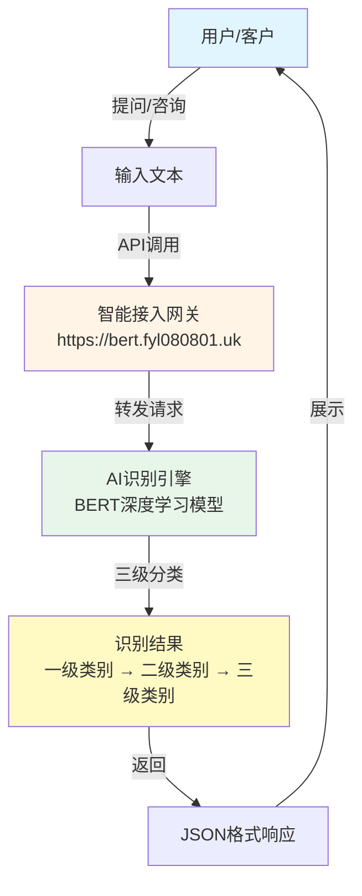
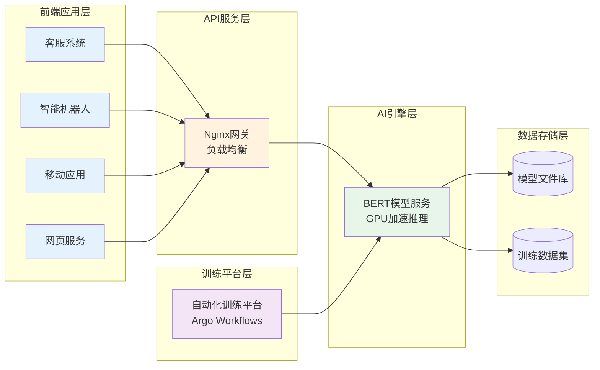
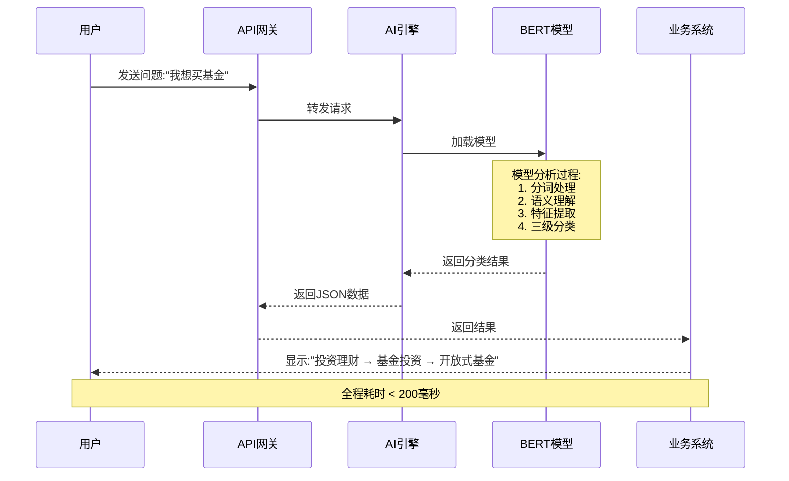
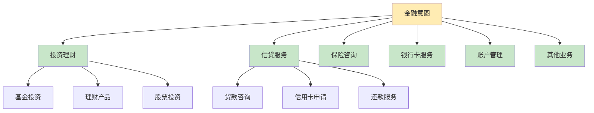
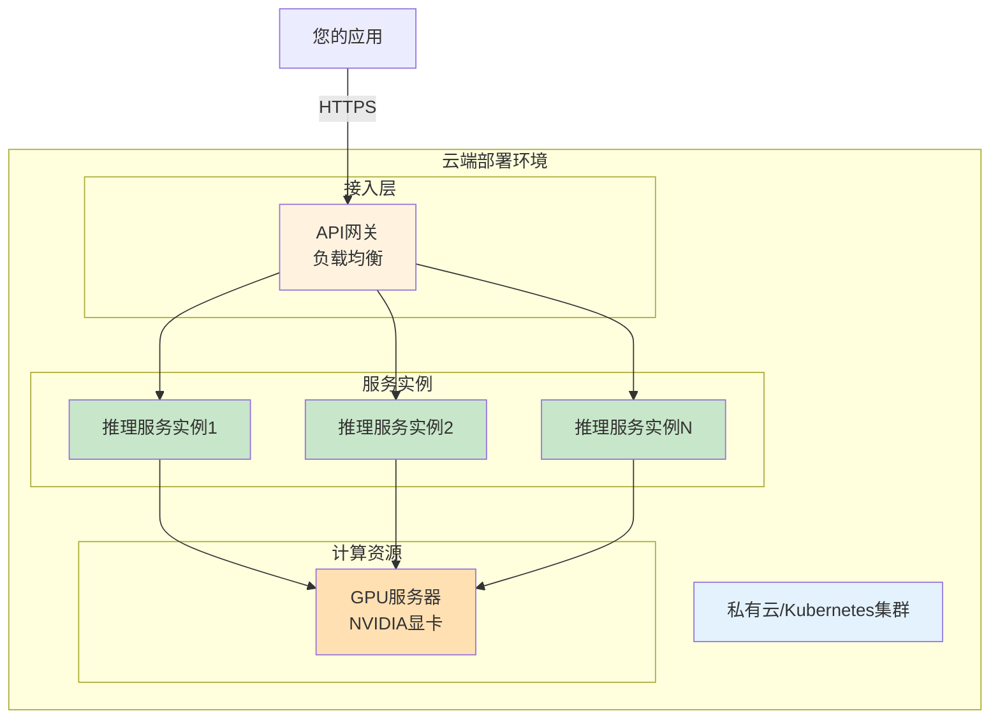

# 金融意图智能识别系统 - 产品介绍

> **让机器理解用户的金融需求**

---

## 🎯 系统能做什么

本系统利用**人工智能技术**和**BERT深度学习模型**,自动识别用户在金融场景下的真实意图,帮助企业:

- ✅ 快速理解客户需求(如:我想购买基金)
- ✅ 自动分类用户咨询(6大类别,3级细分)
- ✅ 提升客服效率,减少人工成本
- ✅ 支持7×24小时自动化服务

### 典型应用场景

| 用户输入 | 系统识别结果 |
|---------|------------|
| "如何购买基金?" | 投资理财 → 基金投资 → 开放式基金 |
| "我想贷款买房" | 信贷服务 → 房贷咨询 → 住房公积金贷款 |
| "信用卡怎么申请" | 信贷服务 → 信用卡申请 → 信用卡办理流程 |
| "理财产品收益如何" | 投资理财 → 理财产品 → 收益计算 |

---

## 📊 系统架构全景图



### 工作原理

1. **用户输入**: 用户发送问题或咨询
2. **API接入**: 通过统一接口访问系统
3. **AI分析**: BERT模型自动理解语义并分类
4. **返回结果**: 系统返回三级分类结果和置信度
5. **业务应用**: 客服系统/智能机器人使用结果

---

## 🏗️ 技术架构



### 核心组件说明

#### 📱 前端应用层
**您的业务系统**可以通过API调用我们的服务

- **客服系统**: 自动识别客户问题类别
- **智能机器人**: 理解用户意图并智能回复
- **移动应用**: 内嵌智能识别功能
- **网页服务**: 在线咨询自动分类

#### 🌐 API服务层
**统一的访问入口**,提供稳定可靠的服务

- 支持高并发访问
- 自动负载均衡
- 7×24小时可用
- 响应时间 < 200ms

#### 🤖 AI引擎层
**系统的核心**,基于BERT深度学习模型

- 使用预训练的中文BERT模型
- 针对金融领域数据微调优化
- GPU硬件加速,实时响应
- 三级层级分类体系

#### 💾 数据存储层
**模型和数据管理**

- 存储多个版本的训练模型
- 支持模型版本快速切换
- 保存历史训练数据

#### 🎓 训练平台层
**持续优化和改进**

- 自动化模型训练流程
- 定期使用新数据优化模型
- 支持增量学习和迭代

---

## 🔄 识别流程详解



### 识别结果示例

**输入**:
```
我想购买一些理财产品,不知道收益怎么样
```

**输出**:
```json
{
  "用户输入": "我想购买一些理财产品,不知道收益怎么样",
  "识别结果": {
    "一级分类": {
      "类别": "投资理财",
      "置信度": "98%"
    },
    "二级分类": {
      "类别": "理财产品",
      "置信度": "95%"
    },
    "三级分类": {
      "类别": "收益查询",
      "置信度": "92%"
    }
  },
  "处理时间": "67毫秒"
}
```

---

## 🎯 分类体系

系统支持**6大类一级分类**,每个一级分类下有多个二级和三级细分:



### 分类说明

| 一级分类 | 二级分类示例 | 典型问题 |
|---------|------------|---------|
| **投资理财** | 基金投资、理财产品、股票投资 | "如何购买基金?""理财产品收益多少?" |
| **信贷服务** | 贷款咨询、信用卡申请、还款服务 | "我想贷款买房""信用卡怎么申请" |
| **保险咨询** | 保险产品、理赔服务、保险咨询 | "重疾险怎么买""车险理赔流程" |
| **银行卡服务** | 开卡服务、挂失服务、银行卡业务 | "银行卡丢了怎么办""如何办新卡" |
| **账户管理** | 密码管理、账户查询、转账服务 | "忘记密码了""账户余额查询" |
| **其他业务** | 投诉建议、业务咨询、其他 | "我要投诉""人工服务" |

---

## 💡 系统优势

### 1. 高准确率

- 基于BERT预训练模型,准确率可达 **95%以上**
- 针对金融领域数据专门优化
- 持续学习,不断改进

### 2. 快速响应

- 单次识别 < 200毫秒
- 支持批量处理
- GPU硬件加速

### 3. 易于集成

```bash
# 简单的API调用示例
curl -X POST https://bert.fyl080801.uk/predict \
  -H "Content-Type: application/json" \
  -d '{"text": "我想购买基金"}'
```

### 4. 高可用性

- 云原生架构,自动容错
- 多副本部署,无单点故障
- 7×24小时稳定运行

### 5. 持续优化

- 自动化训练平台
- 定期使用新数据更新模型
- 支持增量学习

---

## 🔐 安全与性能

### 数据安全

- ✅ 数据传输加密(HTTPS)
- ✅ 访问权限控制
- ✅ 数据隐私保护
- ✅ 审计日志记录

### 性能指标

| 指标 | 数值 |
|-----|-----|
| 响应时间 | < 200ms |
| 并发支持 | > 1000 QPS |
| 系统可用性 | > 99.9% |
| 识别准确率 | > 95% |

---

## 📈 部署方案



### 部署特点

- **云端部署**: 基于Kubernetes云原生架构
- **弹性扩展**: 根据流量自动调整服务实例数量
- **GPU加速**: 使用高性能GPU服务器
- **负载均衡**: 智能分配请求到不同实例
- **高可用**: 多实例部署,自动故障转移

---

## 🚀 使用流程

### 第一步: 接入系统

```python
# Python示例代码
import requests

url = "https://bert.fyl080801.uk/predict"
data = {"text": "我想购买基金"}

response = requests.post(url, json=data)
result = response.json()

print(result)
# 输出:
# {
#   "predictions": {
#     "level1": {"label": "投资理财", "confidence": 0.98},
#     "level2": {"label": "基金投资", "confidence": 0.95},
#     "level3": {"label": "开放式基金", "confidence": 0.92}
#   }
# }
```

### 第二步: 集成到您的业务系统

在您的客服系统、智能机器人或应用中调用API

### 第三步: 获取识别结果

系统返回JSON格式的分类结果,包含:
- 三级分类标签
- 置信度(可信程度)
- 处理时间

### 第四步: 业务处理

根据识别结果进行相应的业务处理

---

## 📞 技术支持

### API文档

- **接口地址**: `https://bert.fyl080801.uk`
- **请求方式**: POST
- **数据格式**: JSON

### 联系方式

- 技术支持: [您的联系方式]
- 问题反馈: [您的问题反馈渠道]
- 文档地址: [在线文档地址]

---

## 🎓 常见问题

### Q: 系统的准确率有多高?

**A**: 在金融领域测试数据上,准确率达到95%以上。我们会持续使用新数据优化模型。

### Q: 响应速度如何?

**A**: 单次识别通常在50-200毫秒之间,完全可以满足实时业务需求。

### Q: 如何保证系统稳定性?

**A**: 采用云原生架构,多副本部署,自动故障转移,系统可用性超过99.9%。

### Q: 支持哪些业务场景?

**A**: 目前支持6大类金融意图分类,覆盖投资理财、信贷服务、保险咨询等主要场景。

### Q: 如何集成到现有系统?

**A**: 提供RESTful API,只需几行代码即可集成。支持Python、Java、Node.js等多种语言。

### Q: 数据安全如何保障?

**A**: 使用HTTPS加密传输,支持访问控制和审计日志,确保数据安全。

---

## 📋 总结

### 为什么选择我们?

✅ **专业**: 专注金融领域,深度优化
✅ **准确**: 95%以上识别准确率
✅ **快速**: < 200ms响应时间
✅ **稳定**: 99.9%系统可用性
✅ **简单**: 简单易用的API接口
✅ **安全**: 企业级安全保障

### 下一步

1. **联系我们**: 获取API密钥和详细文档
2. **技术对接**: 我们提供全程技术支持
3. **测试验证**: 在测试环境验证效果
4. **正式上线**: 快速部署到生产环境

---

**让AI为您的业务赋能,开启智能金融新时代!**
