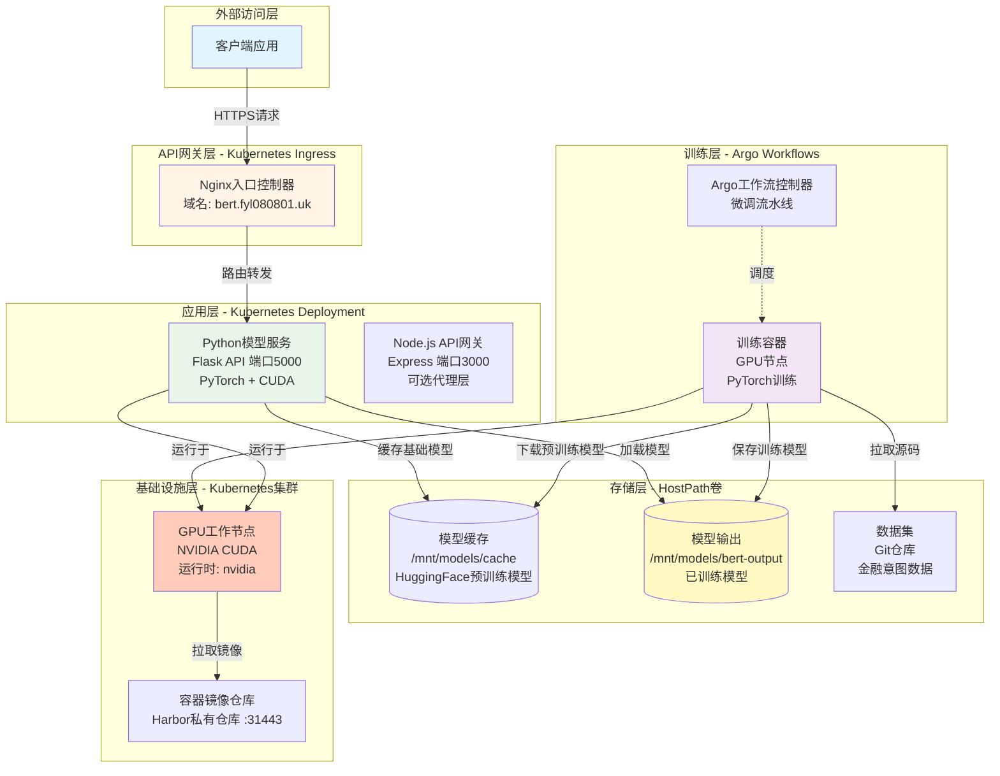
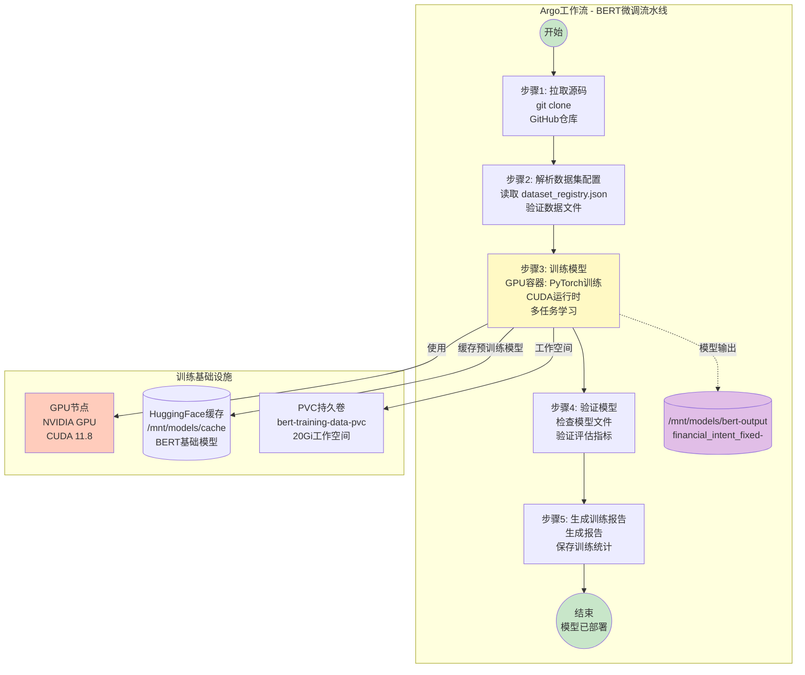
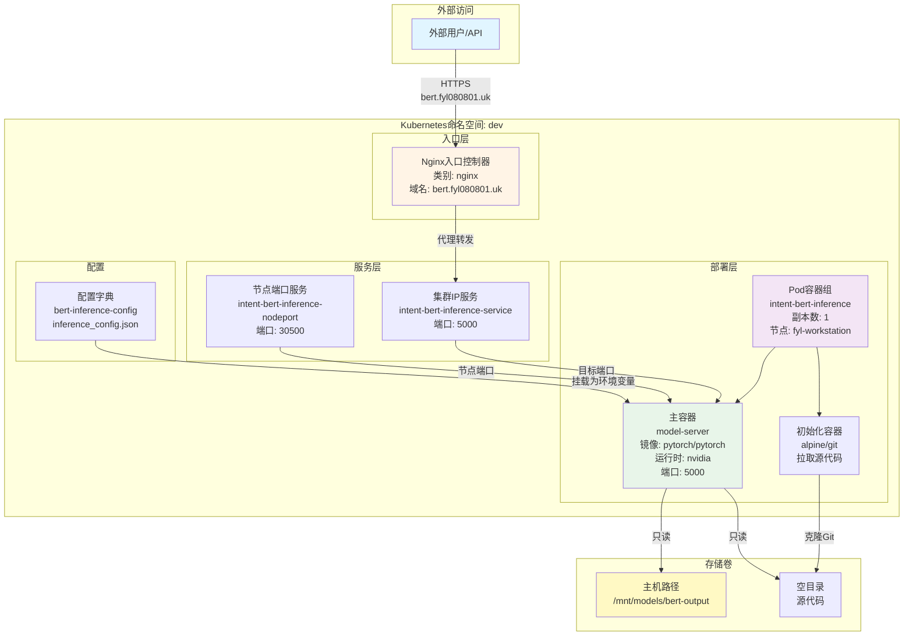
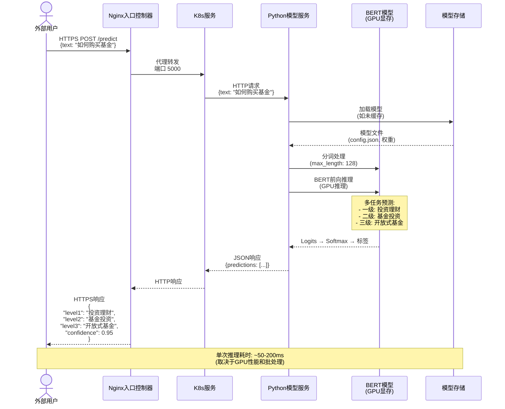
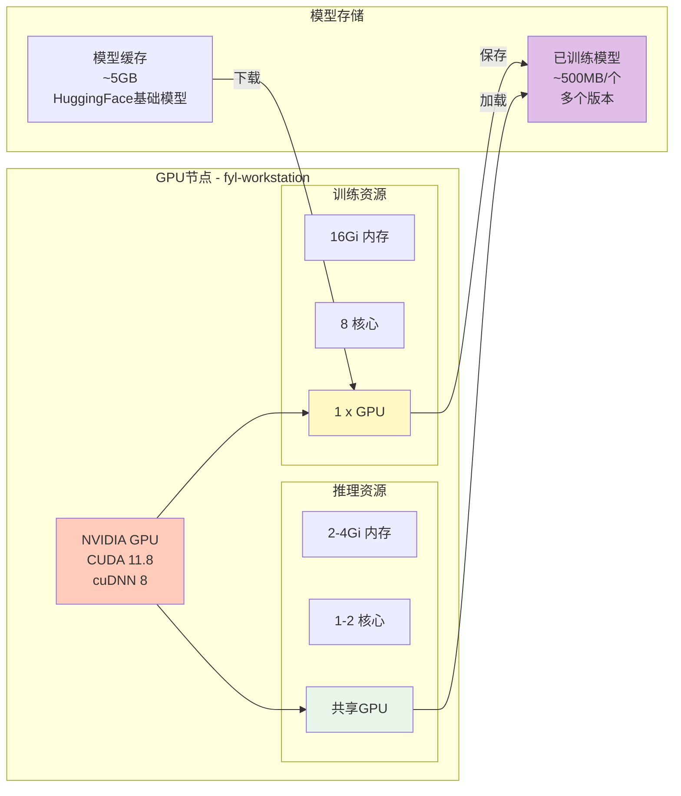
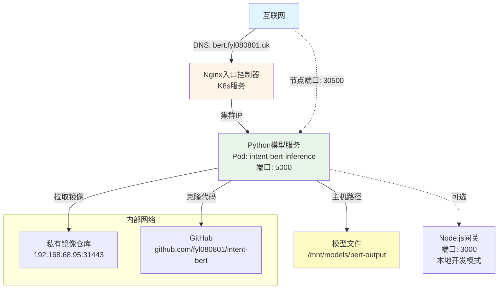

# 金融意图BERT分类系统架构图

## 系统概述

金融意图BERT分类系统是一个基于Kubernetes云原生架构的多任务学习BERT模型平台,支持金融领域用户意图的层级分类。系统采用微服务架构,包含自动化训练流水线、GPU推理服务和API网关。

## 1. 系统整体架构



### 架构说明

系统分为6层结构:

- **外部访问层**: 客户端应用,通过HTTPS访问服务
- **API网关层**: Nginx Ingress Controller提供统一入口和路由
- **应用层**: Python推理服务(Node.js网关可选)
- **训练层**: Argo Workflows编排的自动化训练流水线
- **存储层**: HostPath持久化模型和数据
- **基础设施层**: K8s集群、GPU节点、镜像仓库

## 2. 训练流程 (Argo Workflows)



### 训练流程说明

**步骤1: 拉取源码**

- 镜像: `alpine/git:latest`
- 从GitHub克隆代码库 (branch: `configlabels`)
- 支持指定Git revision

**步骤2: 解析数据集配置**

- 读取 `datasets/dataset_registry.json`
- 支持多种数据集类型:

  - `financial_intent_fixed`: 固定三级层级分类
  - `financial_intent_dynamic`: 动态多级层级分类
  - `jd_sentiment`: 单标签分类
  - `financial_intent_incremental_v1/v2`: 增量训练

- 验证训练/验证数据文件存在

**步骤3: 训练模型**

- **资源要求**: 16Gi内存, 8核CPU, 1个GPU
- **镜像**: `pytorch/pytorch:2.2.0-cuda11.8-cudnn8-runtime`
- **运行时**: `nvidia` (GPU支持)
- **挂载**:

  - HostPath模型缓存: `/mnt/models/cache`
  - HostPath模型输出: `/mnt/models/bert-output`
  - PVC数据卷: `bert-training-data-pvc`

- **训练脚本**: `lib/python/train_universal.py`
- **输出**: 包含UUID的模型目录

**步骤4: 验证模型**

- 检查必需文件: `config.json`, `training_config.json`, `pytorch_model.bin`
- 验证模型结构和配置
- 显示评估指标

**步骤5: 生成训练报告**

- 调用 `generate_training_report.py`
- 保存训练统计信息

### 提交训练任务

```bash
# 使用Argo CLI提交
kubectl argo submit bert-training-universal.yaml \
  -p dataset_name="financial_intent_fixed" \
  -p batch_size="16" \
  -p num_epochs="5" \
  -p learning_rate="2e-5"

# 或使用脚本
./argo-workflows/submit-training.sh
```

---

## 3. 推理服务部署 (K8s Deployment)



### 推理服务说明

**Pod配置**:

- **节点调度**: `nodeName: fyl-workstation` (固定到GPU节点)
- **运行时**: `runtimeClassName: nvidia` (启用CUDA)
- **资源限制**:

  - Request: 2Gi内存, 1核CPU
  - Limit: 4Gi内存, 2核CPU

**Init容器**:

- 镜像: `alpine/git:latest`
- 功能: 从GitHub克隆源代码到emptyDir
- 代理: `http://192.168.68.95:25041`

**主容器**:

- 镜像: `pytorch/pytorch:2.2.0-cuda11.8-cudnn8-runtime`
- 端口: 5000 (Flask API)
- GPU: `CUDA_VISIBLE_DEVICES: 0`
- 健康检查: `/health` 端点
- 启动命令: 安装依赖 → 启动 `model_server.py`

**存储挂载**:

1.  **模型目录** (HostPath, 只读):

    - Host: `/mnt/models/bert-output`
    - Container: `/app/models`
    - 示例路径: `financial_intent_fixed-600e8423-73dd-47e4-9a50-067ecd484a0a`

2.  **源代码** (emptyDir, 只读):

    - Init容器克隆Git
    - 主容器运行代码

**服务暴露**:

1.  **ClusterIP**: 集群内部访问
2.  **NodePort**: 节点端口 30500
3.  **Ingress**: 域名 `bert.fyl080801.uk`

## 4. 数据流详解



### API端点

**推理服务** (端口 5000):

- `POST /predict`: 单条预测
- `POST /predict_batch`: 批量预测
- `GET /model_info`: 模型元信息
- `GET /health`: 健康检查

**请求示例**:

```bash
curl -X POST https://bert.fyl080801.uk/predict \
  -H "Content-Type: application/json" \
  -d '{"text": "如何购买理财产品"}'
```

**响应示例**:

```json
{
  "text": "如何购买理财产品",
  "predictions": {
    "level1": {"label": "投资理财", "confidence": 0.98},
    "level2": {"label": "基金投资", "confidence": 0.95},
    "level3": {"label": "开放式基金", "confidence": 0.92}
  },
  "inference_time_ms": 67
}
```

## 5. 硬件依赖与资源配置



### 硬件要求

**训练节点** (必需):

- GPU: NVIDIA GPU (支持CUDA 11.8)
- 内存: ≥16Gi RAM
- CPU: ≥8核心
- 存储: ≥50Gi (用于模型和数据)

**推理节点** (可与训练节点共享):

- GPU: 推荐 (CPU也可运行但速度慢)
- 内存: ≥4Gi RAM
- CPU: ≥2核心

### GPU加速

**训练时**:

- 使用CUDA运行时: `runtimeClassName: nvidia`
- 环境变量: `CUDA_VISIBLE_DEVICES: 0`
- 显存占用: ~8-12Gi (取决于batch size)

**推理时**:

- 模型加载到GPU内存
- 批处理推理提升吞吐量
- 典型延迟: 50-200ms/样本

## 6. 部署文件清单

### Argo Workflows (训练)

- `argo-workflows/bert-training-universal.yaml` - 通用训练工作流
- `argo-workflows/submit-training.sh` - 训练任务提交脚本

### Kubernetes资源 (推理)

- `argo-workflows/inference-service.yaml` - Deployment + Service
- `argo-workflows/bert-ingress.yaml` - Ingress路由配置

### 本地开发

- `docker-compose.yml` - Docker Compose部署
- `Dockerfile` - 容器镜像构建

## 7. 网络拓扑



### 网络访问方式

1.  **生产环境** (推荐):

    - 域名: `https://bert.fyl080801.uk`
    - 通过Ingress Controller路由

2.  **集群内访问**:

    - Service DNS: `intent-bert-inference-service.dev.svc.cluster.local:5000`

3.  **节点端口访问**:

    - `http://<node-ip>:30500`

## 8. 运维与监控

### 查看训练状态

```bash
# 列出所有工作流
kubectl argo list -n dev

# 查看工作流详情
kubectl argo get <workflow-name> -n dev

# 查看训练日志
kubectl argo logs <workflow-name> -n dev -f
```

### 查看推理服务

```bash
# 查看Pod状态
kubectl get pods -n dev -l app=intent-bert

# 查看服务日志
kubectl logs -f intent-bert-inference-xxxxx -n dev

# 查看模型加载
kubectl exec intent-bert-inference-xxxxx -n dev -- ls -lh /app/models
```

### 监控指标

- Pod CPU/内存使用率
- GPU利用率: `nvidia-smi`
- 请求延迟和吞吐量
- 模型推理准确率

## 9. 安全考虑

- **私有镜像仓库**: Harbor需要认证
- **Git访问**: 通过HTTP代理访问GitHub
- **HostPath权限**: 限制到特定目录
- **网络隔离**: 使用K8s Network Policy
- **API认证**: 可添加JWT/OAuth认证层

## 10. 扩展性

### 水平扩展

- 增加Inference Service副本数
- 使用HPA (Horizontal Pod Autoscaler)

### 垂直扩展

- 增加GPU节点数量
- 调整资源requests/limits

### 多模型支持

- 部署多个推理服务 (不同模型)
- 使用Ingress路由到不同服务

## 总结

该架构实现了:

- ✅ **自动化训练**: Argo Workflows编排GPU训练流水线
- ✅ **云原生部署**: Kubernetes管理推理服务
- ✅ **GPU加速**: CUDA运行时支持硬件加速
- ✅ **高可用**: Ingress + Service + 健康检查
- ✅ **可扩展**: 支持水平和垂直扩展
- ✅ **易维护**: 基础设施即代码 (GitOps)

